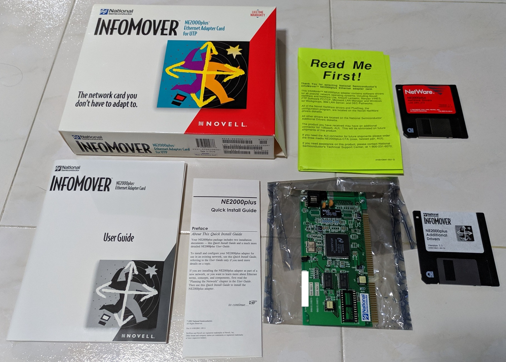
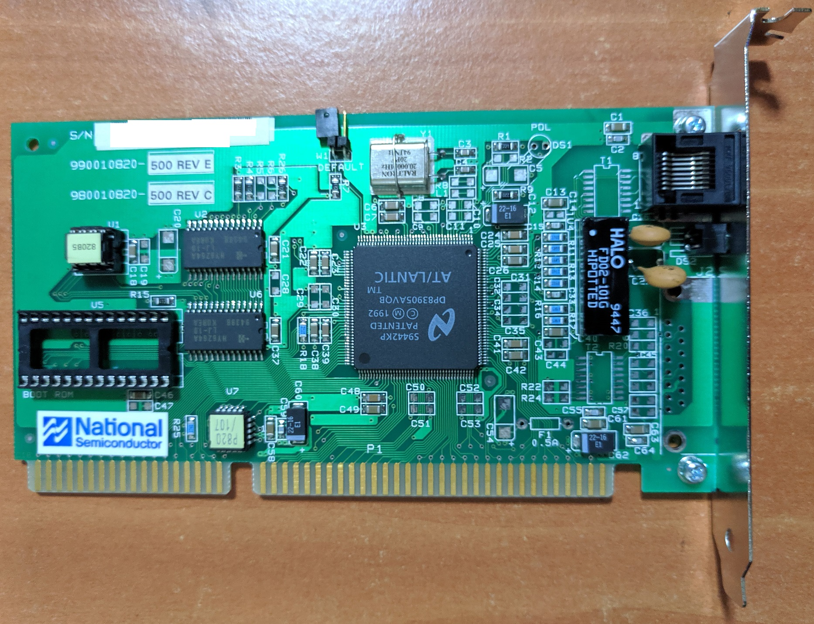
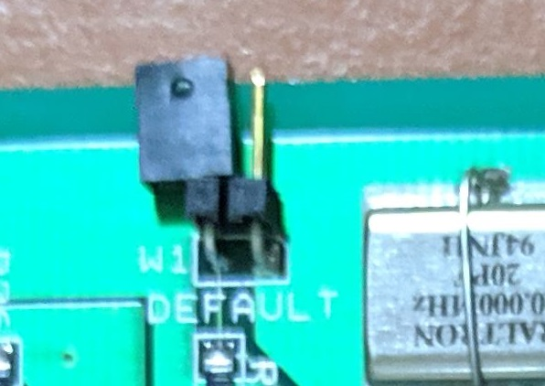
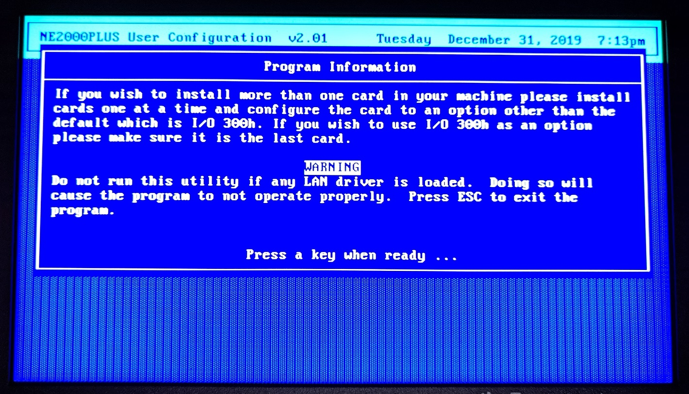
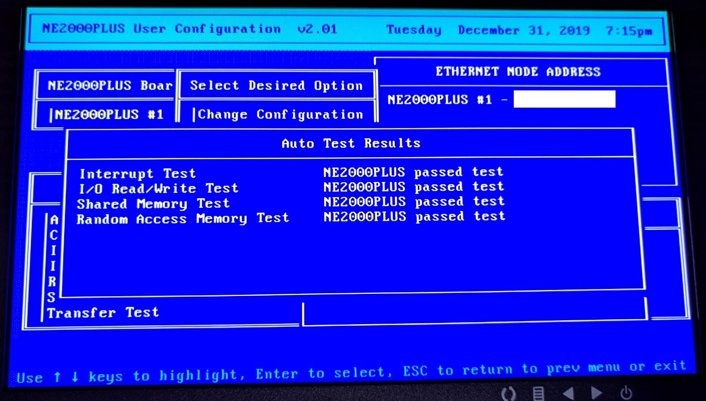
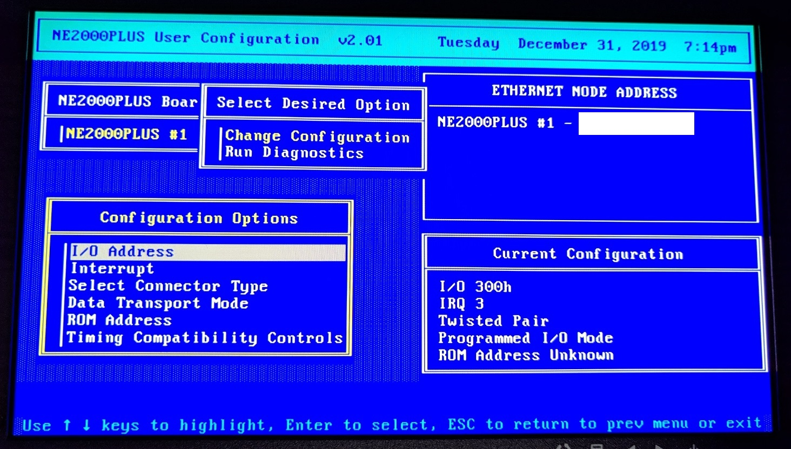
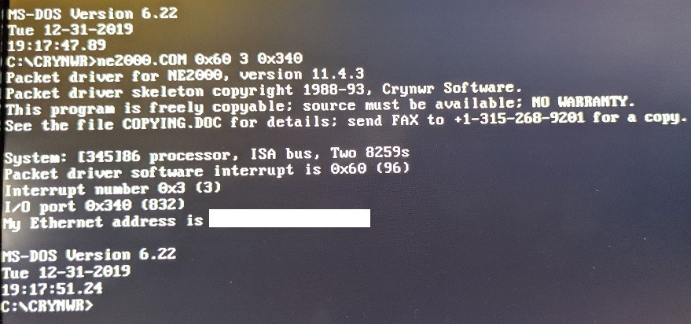
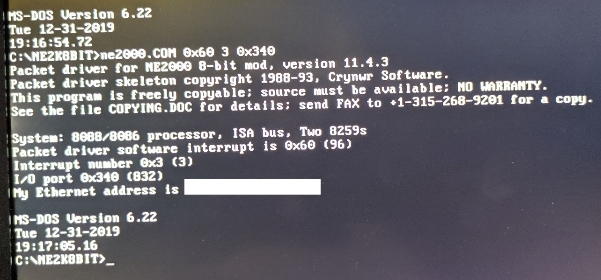

# ne2000plus-collection
Collection of NE2000+ software obtained from various sources. 


This repo was started to hold the info for my network card to prevent them from being lost to time.


Close up view of my card.

# Configuring the Base I/O address and interrupt

The default base I/O is `300h` and `IRQ 3`. If you need to change these because of conflicts with other devices, you need to use the `Plusdiag` utility.

`Plusdiag` may be able to detect the card even at non-default settings and in a 8-bit slot. However if you have issues, set the initial I/O and IRQ to be their defaults and put card in a 16-bit ISA slot.

1. Power off your PC and short the default jumper on both pins.


This jumper is currently unshorted.

2. Start up your PC with the shorted jumper in place. The card will go back to default settings.

3. Configure the card with `Plusdiag`. The moment you leave `Plusdiag`, the card is actually configured with the new settings.

4. Power off the PC and unshort the jumper.

5. Restart your PC.

## Using Plusdiag

1. Start the `Plusdiag` app.


Note the warnings.

2. I felt it was helpful to run the tests as a sanity check before doing anything.



3. Change your configuration



Available I/O ports are: 300h, 320h, 340h, 360h, 240h, 280h, 2C0h
Available IRQs are: 2, 3, 4, 5, 10, 11, 12, 15

Note for 8-bit operations, only IRQ 2-7 are usable.

# Drivers

Drivers are provided in the floppy disk but I opted to use the CWYNR drivers as they are easier to use.

## Original Crynwr drivers
This is meant for 16-bit ISA operation.



Provide the packet interface interrupt, IRQ and base I/O address.

```bash
ne2000.com 0x60 3 0x340
```
The base I/O address of my card is set at `0x340` as `0x300` is used by another device.

A tell-tale sign of an improper configuration is that the Ethernet Address is not shown properly.

## 8-bit modified driver

Someone modified the Crynwr drivers for 8-bit operation.



Specifiy the same command line arguments.

## Others

I copied out DOS, OS/2 and NDIS drivers from the "Additional Drivers Version 1.1" disk to the `ne2000-add-drivers` directory. I have not tested them.

The Netware Drivers disk LAN_DRV_412 was faulty so no data from there.

# References

1. [PlusDiag](https://www.driverguide.com/driver/detail.php?driverid=69426)
2. [Crynwr drivers](https://www.ibiblio.org/pub/micro/pc-stuff/freedos/files/distributions/1.2/repos/pkg-html/crynwr.html)
3. [Crynwr 8-bit](http://www.vcfed.org/forum/showthread.php?41081-NE2000-Packet-drivers-for-8-bit-slots)
